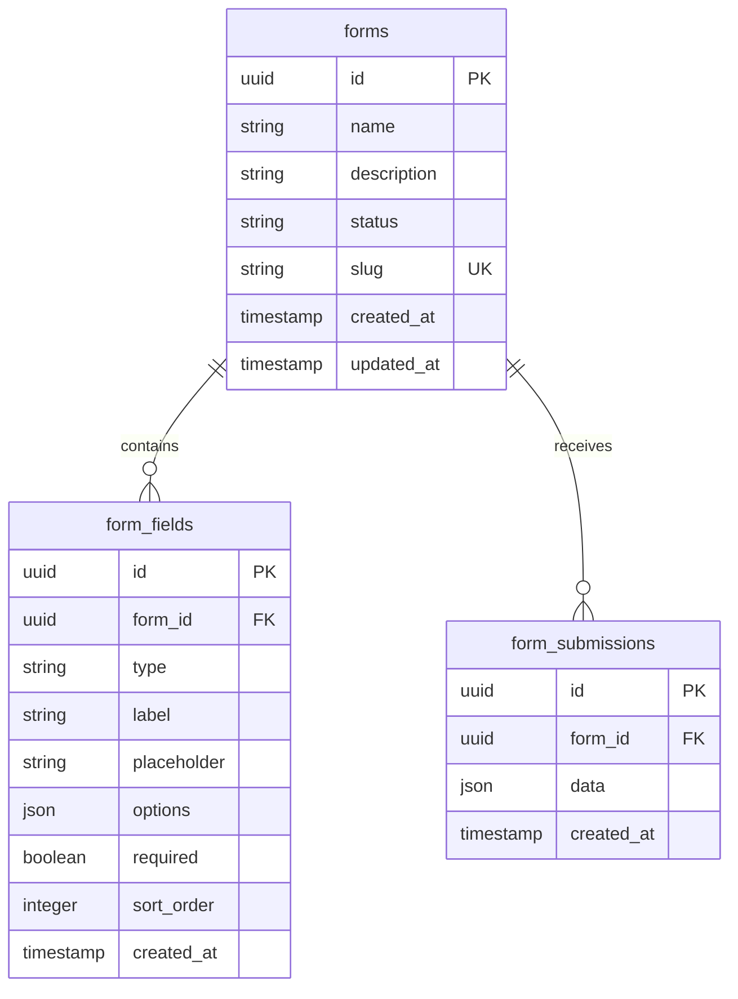

# Data Model: Form Management Improvements

**Feature**: 004-form-management-improvements
**Date**: 2026-01-05

## Entity Relationship



## Entities

### Form

**Description**: Main form entity representing a user's form

| Field | Type | Constraints | Description |
|-------|------|-------------|-------------|
| id | UUID | PK, Auto-generated | Unique identifier |
| name | VARCHAR(255) | NOT NULL | Form title |
| description | TEXT | NULL | Form description |
| status | ENUM | NOT NULL, DEFAULT 'draft' | draft, published |
| slug | VARCHAR(255) | UNIQUE, NULL | Shareable URL slug |
| created_at | TIMESTAMP | DEFAULT NOW() | Creation time |
| updated_at | TIMESTAMP | DEFAULT NOW() | Last update time |

**Relationships**:
- One-to-Many with FormField (cascade delete)
- One-to-Many with FormSubmission (cascade delete)

### FormField

**Description**: Individual field definitions within a form

| Field | Type | Constraints | Description |
|-------|------|-------------|-------------|
| id | UUID | PK, Auto-generated | Unique identifier |
| form_id | UUID | FK, NOT NULL | Parent form reference |
| type | ENUM | NOT NULL | text, textarea, date, select, checkbox, radio |
| label | VARCHAR(255) | NOT NULL | Field label displayed to users |
| placeholder | VARCHAR(255) | NULL | Placeholder text |
| options | JSON | NULL | Options for select/radio/checkbox |
| required | BOOLEAN | DEFAULT FALSE | Whether field is required |
| sort_order | INTEGER | DEFAULT 0 | Display order |
| created_at | TIMESTAMP | DEFAULT NOW() | Creation time |

**Relationships**:
- Many-to-One with Form (cascade delete)

### FormSubmission

**Description**: User-submitted responses to a form

| Field | Type | Constraints | Description |
|-------|------|-------------|-------------|
| id | UUID | PK, Auto-generated | Unique identifier |
| form_id | UUID | FK, NOT NULL | Parent form reference |
| data | JSON | NOT NULL | Submission responses keyed by field ID |
| created_at | TIMESTAMP | DEFAULT NOW() | Submission time |

**Relationships**:
- Many-to-One with Form (cascade delete)

## Validation Rules

### Form Validation (Zod)

```typescript
const formSchema = z.object({
  name: z.string().min(1).max(255),
  description: z.string().max(1000).optional(),
});
```

### FormField Validation (Zod)

```typescript
const formFieldSchema = z.object({
  type: z.enum(['text', 'textarea', 'date', 'select', 'checkbox', 'radio']),
  label: z.string().min(1).max(255),
  placeholder: z.string().max(500).optional(),
  options: z.array(z.string()).optional(),
  required: z.boolean().default(false),
  sortOrder: z.number().int().default(0),
});
```

### Submission Validation (Zod)

```typescript
// Generated dynamically based on form fields
const createSubmissionSchema = (fields: FormField[]) => {
  const shape: Record<string, z.ZodTypeAny> = {};
  fields.forEach(field => {
    if (field.required) {
      shape[field.id] = z.any().refine(val => val !== null && val !== undefined, {
        message: `${field.label} is required`,
      });
    }
  });
  return z.object(shape);
};
```

## State Transitions

### Form Status

```
draft → published (one-way, immutable after publish)
```

**Rationale**: Published forms are immutable to maintain data integrity for existing submissions.

### Cascade Delete

When a Form is deleted:
1. All FormField records with matching form_id are deleted
2. All FormSubmission records with matching form_id are deleted

**Implementation**: Database foreign key with `ON DELETE CASCADE`

## Indexes

| Table | Index | Fields | Purpose |
|-------|-------|--------|---------|
| forms | idx_forms_slug | slug | Share link lookup |
| forms | idx_forms_status | status | Filter by status |
| form_fields | idx_form_fields_form_id | form_id | Field lookup |
| form_submissions | idx_submissions_form_id | form_id | Submission lookup |
| form_submissions | idx_submissions_created_at | created_at | Sort by date |

## Migrations Required

```sql
-- Add cascade delete to existing foreign keys (if not already configured)
-- This is typically handled in the schema definition via drizzle-orm

-- No additional migrations expected if schema already has foreign keys
```

## Key Decisions

1. **UUID vs Integer IDs**: UUIDs provide better distribution and avoid ID collision
2. **JSON for submission data**: Flexible structure accommodates varying field types
3. **Cascade delete at DB level**: Most reliable, transaction-safe
